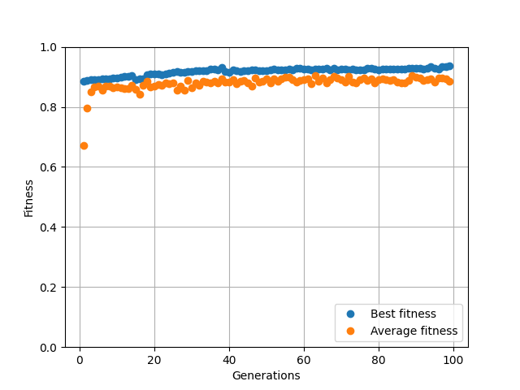

# Genetic TensorFlow

This package contains the necessary programs to run a "genetic" algorithm on TF/Keras feed-forward neural networks. It can be fully configured to run the way you want.

## How to use it

### Installation

To use it, just install the package :

```bash
git clone https://github.com/charon25/GeneticTF.git
cd GeneticTF
python setup.py install
```

Then you should only need to import one class :

```python
from genetictf import EvolutionManager
```

### Instiantiate the evolution manager

You can create a manager in two ways : either with all its necessary parameters, or with a file containing the data.

```python
from genetictf import EvolutionManager

# First way
evoman = EvolutionManager(parameters)
evoman.initialize_population()

# Second way
evoman = EvolutionManager.from_file(".\\model.json")
# No need to initialize the population in this case
```

### Architecture

Every network will be composed of multiple dense layers (sometimes separated by dropout layers) whose activation function and number of neurons will evolve over time.

### Parameters

The parameters should be a dictionary with the following entries :

- `"network_creation_parameters"`, an array of length 5 describing how to generate new random networks. Its elements are :
    - the minimum number of layers of the network (int) ;
    - the maximum number of layers (int) (inclusive) ;
    - the size of the output layer (int) ;
    - the type of the output (str) which can be :
        - `"classification_one_value"` if the network is a classifier and its labels are integers ;
        - `"classification_multiple_values"` if the network is a classifier with one-hot encoded labels ;
        - `"values"` if the network should predict continuous outputs.
    - the network loss function (None or str) : if it is None, it will start with a random one.
- `"network_mutation_parameters"`, an array of length 4 describing how the networks will mutate over time. Its elements are :
    - the probability of gaining a new layer at a random place (float) ;
    - the probability of losing a random layer (float) ;
    - the probability of having its output layer activation function change (float) ;
    - the probability of having its loss function change (float). Set to 0 to keep the same loss function at all time.
- `"layer_creation_parameters"`, an array of length 4 describing how to create new random layers. Its elements are :
    - the minimum number of neurons of the layer (int) ;
    - the maximum number of neurons (int) (inclusive) ;
    - the probability for the layer to have a dropout layer after the dense (float) ;
    - the maximum dropout rate (float) (the real one is chosen uniformly between 0 and this value).
- `"layer_mutation_parameters"`, an array of length 5 describing how the layers will mutate over time. At each mutation, a random number following a normal distribution will be added to the number of neurons, and it will be rounded. Its elements are :
    - the mean of the normal distribution of the number of neurons change (float) ;
    - its standard deviation (float) ;
    - the probability of having its activation function change (float) ;
    - the probability of gaining a dropout layer if it does not have one already, or the lose it when it already does (float) ;
    - the variation of the dropout rate (float) (the change is chosen uniformly in the interval [-variation, variation]).
- `"population_size"` : number of networks in each generation (int) ;
- `"survivors_by_generation"` : number of networks which will stay on next generation (after sorting) ;
- `"mutated_by_generation"` : number of networks which will produce offsprings (can be grater or smaller than the number of survivors) ;
- `"random_by_generation"` : number of new random networks to add at each generation ;
- `"fit_parameters"`, an array of length 4 describing how to train the networks. Its elements are :
    - number of independant trainings (int) (the more the better the accuracy will be) ;
    - number of epochs for each training (int) ;
    - size of batchs of the trainings (int) ;
    - verbosity of tensorflow training.

#### Example
```python
PARAMETERS = {
    'network_creation_parameters': [1, 2, 2, 'classification_one_value', 'scclogits'],
    'network_mutation_parameters': [0.2, 0.2, 0.2, 0],
    'layer_creation_parameters': [1, 5, 0.5, 0.2],
    'layer_mutation_parameters': [0.5, 1.1, 0.1, 0.1, 0.03],
    'population_size': 20,
    'survivors_by_generation': 3,
    'mutated_by_generation': 5,
    'random_by_generation': 2,
    'fit_parameters': [30, 40, 80, 0]
}
```

### Generations

There are three ways of doing generations : one by one, multiple at once, or "infinite". They all have at least the following arguments :
- `data` and `labels` : the data and labels to the train the networks on ;
- `split` : the fraction data to use as training data (optional, default is 0.8) ;
- `worker_count` : number of networks to do in parallel for each generation. 
The optimal choice depends on your computer (optionnal, default is 3).

The other arguments are :
- `generation_count` : number of generations to pass ;
- `savepath` : filepath to save the model after an interrupt or at each generation, or None to not save it ;
- `save_each_gen` : indicates if the model should be saved after each generation.

Those functions will always return the best, average and worst fitness of each generation as a tuple (or list of tuples).

```python
evoman.pass_one_generation(data, labels, split, worker_count)

evoman.pass_n_generations(generation_count, data, labels, split, worker_count)

evoman.pass_generations(savepath, data, labels, split, worker_count, save_each_gen)
```

When doing "infinite" generations, you have to use Ctrl+C (or generate a KeyboardInterrupt) to stop the evolution : if the worker count is 1, it will stop right away, otherwise it will stop at the end of the generation.

### Outputs

#### Saving the model

To save a model, just use the save method of the evolution manager :

```python
evoman.save(filepath)
```

#### Printing the generation

```python
evoman.print()
```

#### Graphing the fitnesses

```python
# `show` indicated if the plot should be displayed
# `savepath` is the optional path of the image containing the graph
evoman.graph(show=True, savepath=None)
```

## Complete MNIST example

```python
import os
os.environ['TF_CPP_MIN_LOG_LEVEL'] = '3'

from genetictf import EvolutionManager
import numpy as np
import tensorflow as tf


mnist = tf.keras.datasets.mnist

(x_train, y_train), (x_test, y_test) = mnist.load_data()
x_train, x_test = x_train / 255.0, x_test / 255.0
x_train = x_train.reshape(60000, 28*28)
x_test = x_test.reshape(10000, 28*28)

x = np.concatenate((x_train, x_test), axis=0)
y = np.concatenate((y_train, y_test), axis=0)
p = np.random.permutation(len(x))
x = x[p]
y = y[p]

MODEL_PATH = '.\\mnist_model.json'

PARAMETERS = {
    'network_creation_parameters': [1, 4, 10, 'classification_one_value', 'scclogits'],
    'network_mutation_parameters': [0.2, 0.2, 0.2, 0],
    'layer_creation_parameters': [5, 25, 1, 0.2],
    'layer_mutation_parameters': [0.5, 1.1, 0.1, 0.1, 0.03],
    'population_size': 5,
    'survivors_by_generation': 1,
    'mutated_by_generation': 3,
    'random_by_generation': 1,
    'fit_parameters': [2, 5, 128, 0]
}


evoman = None
if not os.path.exists(MODEL_PATH):
    print('New evolution')
    evoman = EvolutionManager(PARAMETERS)
    evoman.initialize_population()
else:
    print('Loading file')
    evoman = EvolutionManager.from_file(MODEL_PATH)

evoman.pass_generations(MODEL_PATH, x[:5000], y[:5000], 0.85, worker_count=3, save_each_gen=True)

evoman.print()
evoman.graph(True, 'mnist_accuracies.png')
```

After 99 generations, the networks have improved a little bit (the training was very limited on purpose to try to see the effect of evolution) :



Here, the fitness is the accuracy of the network.

The best went from 88.5 % to 93.6% accuracy, while the average went from 67.2 % to 88.6 %.